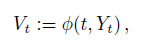
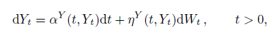
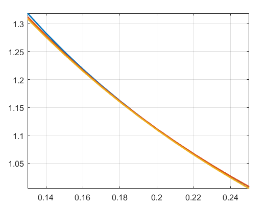
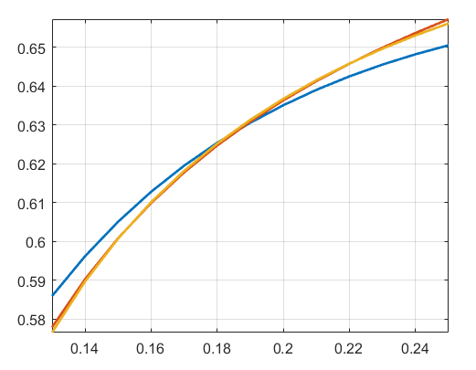
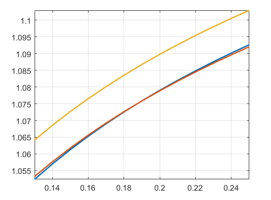

________________________________________________________________________________________________________________________________________
## Latest downloads

- [MATLAB Toolbox installer (recommended)](https://github.com/abarletta/viximpv/releases/download/17.11/VIX.Implied.Volatility.mltbx)
- [Zip archive containing all codes](https://github.com/abarletta/viximpv/releases/download/17.11/VIX.Implied.Volatility.zip)

________________________________________________________________________________________________________________________________________

<b>Current version</b> <br>
November 2017<br>
<b>Author</b> <br>
[Andrea Barletta](http://pure.au.dk/portal/en/persons/id(e161f76b-35b6-4903-b768-e8b172cbede5).html)<br>

________________________________________________________________________________________________________________________________________
## Getting Started

This toolbox computes approximate values of the Black & Scholes implied volatility of VIX options using a perturbative technique applied to the infinitesimal generator of the underlying process. The modelling setup requires that the VIX index dynamics is explicitly computable as a smooth transformation <i>φ</i> of a purely diffusive, one-dimensional Markov process Y. Specifically:

<p align="center">
<br>       

</p>
where <i>W</i> denots a Brownian motion. More details can found in <a href="https://papers.ssrn.com/sol3/papers.cfm?abstract_id=2942262">this paper</a>.

### Prerequisites

This code has been tested on MATLAB R2017a but it should work on any version of MATLAB that supports symbolic calculus. The following MATLAB Toolboxes are required to ensure full compatibility of the code: 

- Symbolic Math Toolbox 

### Installing rndfittool

There are two options to install the VIX Implied Volatility Toolbox on your machine.

#### Installing rndfittool as MATLAB App (recommended)
- Download the [MATLAB Toolbox installer](https://github.com/abarletta/viximpv/releases/download/17.11/VIX.Implied.Volatility.mltbx).
- Double-click on the file to start the installation process.
- If the double-click does not work you may alternatively open the file by dragging it into the MATLAB command window.
- After the installation you can run the main function _viximpv_.
- If the installation does not work switch to the next method.

#### Installing rdnfittool through zip archive
- Download the [zip archive](https://github.com/abarletta/viximpv/releases/download/17.11/VIX.Implied.Volatility.zip) containing all the necessary resources.
- Extract the archive contents into a local folder.
- Set the folder containing the extracted file as MATLAB current folder or, alternatively, add it to the MATLAB path list. 
- Type <code>rndfittool</code> to run the tool.


________________________________________________________________________________________________________________________________________
## Usage
```matlab
[Sigma,Futures]=VIXIMPV(Mu,Eta,Phi,Y0,K,T,Order)
```
### Input
- `Mu`: Drift coefficient of Y (function handle)
- `Eta`: Diffusion coefficient of Y (function handle)
- `Phi`  -  Function mapping Y to VIX (function handle or symbolic function)
- `Y0`  -  Initial value of Y (scalar)
- `K`  -  Strike values (vector)
- `T`  -  Maturity (scalar)
- `Order`  -  Expansion order (integer between 0 and 4)

### Output
- `Sigma`: Approximate VIX implied volatility
- `Futures`: Approximate VIX futures price
________________________________________________________________________________________________________________________________________
## Examples

### Heston model
#### MATLAB code
```matlab
% Setting model parameters
Kappa=3;
Theta=0.04;
Epsilon=0.5;
Y0=0.035;
% Drift
Mu=@(y) Kappa*(Theta-y);
% Diffusion
Eta=@(y) Epsilon*sqrt(y);
% Function Phi
Tau=30/365;
a=(1-exp(-Kappa*Tau))/(Kappa*Tau);
b=Theta*(1-a);
Phi=@(y) sqrt(a*y+b);
% Setting maturity and strikes
T=1/48;
K=.13:.01:.25;
% Computing approximate implied volatilities
Sigma2=viximpv(Mu,Eta,Phi,Y0,K,T,2);
Sigma3=viximpv(Mu,Eta,Phi,Y0,K,T,3);
Sigma4=viximpv(Mu,Eta,Phi,Y0,K,T,4);
% Plotting
plot(K,[Sigma2; Sigma3; Sigma4],'LineWidth',2);
axis tight;
grid on;
```
<p align="center">

</p>

### Mean-reverting CEV model

#### MATLAB code
```matlab
% Setting model parameters
Kappa=3;
Theta=0.04;
Epsilon=1.5;
Y0=0.035;
% Drift
Mu=@(y) Kappa*(Theta-y);
% Diffusion
Eta=@(y) Epsilon*y;
% Phi
Tau=30/365;
a=(1-exp(-Kappa*Tau))/(Kappa*Tau);
b=Theta*(1-a);
Phi=@(y) sqrt(a*y+b);
% Setting maturity and strikes
T=1/48;
K=.13:.01:.25;
% Computing approximate implied volatilities
Sigma2=viximpv(Mu,Eta,Phi,Y0,K,T,2);
Sigma3=viximpv(Mu,Eta,Phi,Y0,K,T,3);
Sigma4=viximpv(Mu,Eta,Phi,Y0,K,T,4);
% Plotting
plot(K,[Sigma2; Sigma3; Sigma4],'LineWidth',2);
axis tight;
grid on;
```
<p align="center">

</p>

### Exp-OU model

#### MATLAB code
```matlab
% Setting model parameters
Lambda=10;
Theta=0.02;
Epsilon=3.5;
Y0=-3.3;
% Drift
Mu=@(y) Lambda*(log(Theta)-y);
% Diffusion
Eta=@(y) Epsilon;
% Phi
syms x y;
Tau=30/365;
g=exp(exp(-Lambda*x).*y+log(Theta)*(1-exp(-Lambda*x))+Epsilon^2/(4*Lambda)*(1-exp(-2*Lambda*x)));
Phi=(1/sqrt(Tau))*sqrt(int(g,x,0,Tau));
% Setting maturity and strikes
T=1/48;
K=.13:.01:.25;
% Computing approximate implied volatilities
Sigma2=viximpv(Mu,Eta,Phi,Y0,K,T,2);
Sigma3=viximpv(Mu,Eta,Phi,Y0,K,T,3);
Sigma4=viximpv(Mu,Eta,Phi,Y0,K,T,4);
% Plotting
plot(K,[Sigma2; Sigma3; Sigma4],'LineWidth',2);
axis tight;
grid on;
```
<p align="center">

</p>

